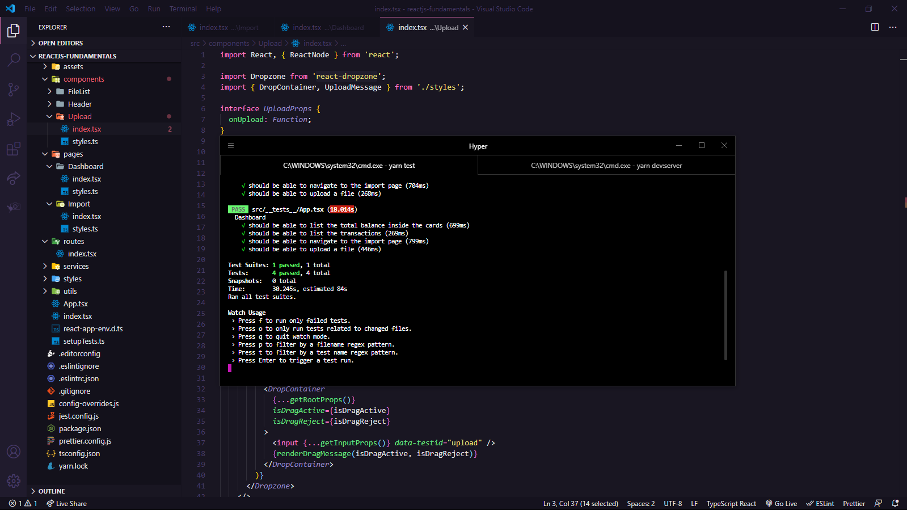

_English_

# React.JS Fundamentals

🚀 About the challenge

In this challenge, I had to continue developing the transaction management application, GoFinances.
The objective was to practice what I had learned so far in React.js together with TypeScript, using routes and sending files by form.

This was an application that had to connect to my [Challenge 06](https://github.com/devgabrieldejesus/database-upload) backend, and display the created transactions and allow the import of a CSV file to generate new records in the database.

`Screenshot of tests`

---

_Português_

# Fundamentos React.JS

🚀 Sobre o desafio

Nesse desafio, eu tinha que continuar desenvolvendo a aplicação de gestão de transações, a GoFinances.
O Objetivo era praticar o que tinha aprendido até agora no React.js junto com TypeScript, utilizando rotas e envio de arquivos por formulário.

Essa foi uma aplicação que tinha que se conectar ao meu backend do [Desafio 06](https://github.com/devgabrieldejesus/database-upload), e exibir as transações criadas e permitir a importação de um arquivo CSV para gerar novos registros no banco de dados.

`Captura de tela dos testes`

